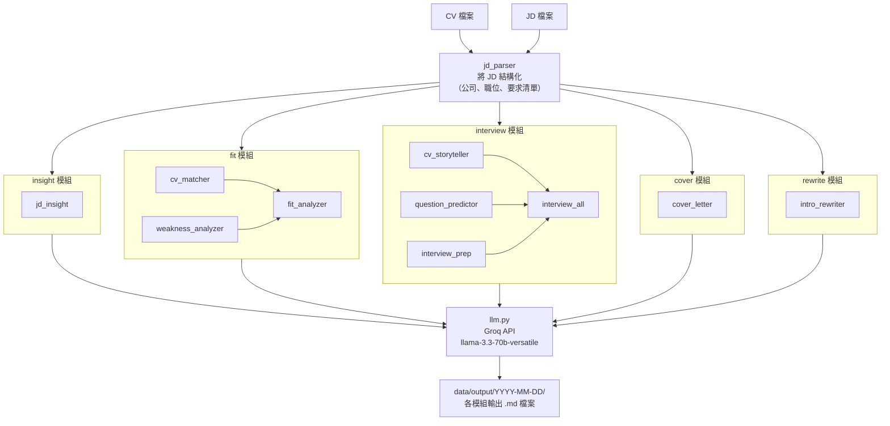

# CV / JD Analyzer — 期末報告

## 一、專案動機

求職是一件資訊密度極高的工作。一份職缺描述（Job Description）裡面藏著公司真正在找什麼人、願意篩掉誰、面試時最在意哪個點，但這些資訊往往隱藏在制式化的條文背後，不容易直接看出來。

傳統做法是靠求職者自己閱讀 JD、比對自己的履歷、猜面試官的意圖、手動寫 Cover Letter——這整個流程耗時、重複、且品質不穩定。

這個專案的目標是把以上流程自動化：給定一份 CV 和一份 JD，系統自動生成六種求職分析文件，讓使用者把時間花在準備本身，而不是整理資訊。

---

## 二、系統概述

**CV / JD Analyzer** 是一個基於 LLM 的多模組求職分析工具，輸入一份 CV 和職缺描述，輸出以下六種文件：

| 模組 | 功能說明 |
|------|---------|
| `insight` | JD 深度解讀：找出職缺真正的核心能力需求、門面話、背後的公司困境，以及最重要的面試準備方向 |
| `fit` | 匹配度分析 + 弱項診斷：逐條對照 JD 要求 vs CV 佐證，找出缺口，給出補強建議 |
| `interview` | 面試全準備：從 CV 提煉三個經歷亮點並整理成 STAR 結構、預測技術題 + 行為題、附 STAR 提示 |
| `cover` | Cover Letter 生成：客製化繁中求職信，只引用 CV 中存在的事實，找不到佐證標記 `[需確認]` |
| `rewrite` | 自我介紹改寫：以 JD 為目標，改寫現有自我介紹的重點與開場邏輯 |

---

## 三、系統架構

```
cv-jd-analyzer/
├── main.py              # CLI 入口（命令列執行）
├── app.py               # Flask Web 介面入口
├── src/
│   ├── llm.py           # LLM API 呼叫封裝（Groq）
│   ├── pdf_parser.py    # PDF 文字解析（PyMuPDF）
│   ├── file_manager.py  # 輸出檔管理（依日期存檔）
│   └── agents/          # 各功能模組
│       ├── jd_parser.py       # JD 結構化解析（前置步驟）
│       ├── jd_insight.py      # JD 深度解讀
│       ├── cv_matcher.py      # 匹配度分析
│       ├── weakness_analyzer.py  # 弱項診斷
│       ├── fit_analyzer.py    # 匹配度 + 弱項（組合模組）
│       ├── cv_storyteller.py  # 經歷亮點與 STAR 整理
│       ├── question_predictor.py  # 面試題預測
│       ├── interview_prep.py  # 面試準備建議
│       ├── interview_all.py   # 面試全準備（組合模組）
│       ├── cover_letter.py    # Cover Letter 生成
│       └── intro_rewriter.py  # 自我介紹改寫
├── prompts/             # 各模組的 prompt 模板（.md 格式）
├── templates/           # Web 介面前端（index.html）
└── data/
    ├── cv/              # 使用者放 CV
    ├── jd/              # 使用者放 JD
    └── output/          # 生成結果，依日期分資料夾
```

### 執行流程



---

## 四、技術選型說明

### 語言模型

使用 [Groq](https://groq.com) 平台的 `llama-3.3-70b-versatile`：
- **為什麼選 Groq**：Llama 3.3 70B 免費額度足夠個人使用，且 Groq 的 inference 速度比 OpenAI 快，繁體中文輸出品質穩定
- **為什麼不用 GPT-4o**：付費成本；這個任務對最新知識的依賴低，70B 級別的 open model 已夠用

### Web 框架

使用 Flask（輕量 Python Web 框架）：
- 這個工具是個人使用 / 小團隊工具，不需要 Django 等級的複雜度
- Flask + Jinja2 模板讓整個 Web 介面只需要一個 `app.py` 和一個 `index.html`

### PDF 解析

使用 PyMuPDF（`pymupdf`）：
- 比 `pdfminer` 快，API 簡單，對中文字型支援好
- 限制：Canva 製作的 PDF 因為字型嵌入方式不同，解析結果可能有亂碼，建議另存純文字

### Prompt 設計

每個模組的 prompt 放在獨立的 `.md` 檔案（`prompts/` 目錄），與 Python 程式碼分離：
- 優點：可以不動程式碼只修改 prompt，版本控管清楚
- 每個 prompt 都給 LLM 一個具體的角色（獵頭顧問、職涯顧問等）和明確的輸出格式要求，降低 hallucination

---

## 五、使用方式

### Web 介面模式

```bash
python app.py
# 開瀏覽器前往 http://localhost:5001
```

Web 介面提供：
- 貼上 CV 文字或上傳 PDF
- 貼上 JD 文字
- 勾選要執行的模組
- 瀏覽器內直接顯示分析結果（Markdown 渲染）
---

## 六、後續可擴充方向

- **多語言 JD 支援**：讓 jd_parser 自動偵測語言，切換對應的 prompt
- **比較模式**：同一份 CV 對多個 JD 同時分析，生成「哪個機會最適合」的排名
- **歷史記錄介面**：把 data/output/ 的分析結果做成可搜尋的歷史紀錄，方便追蹤不同求職機會的進度
